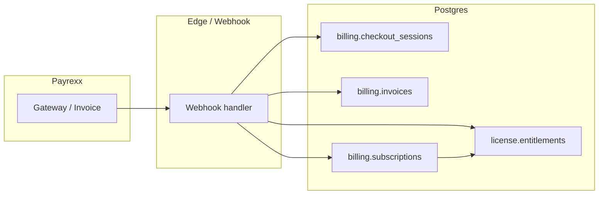

# License and entitlement flows

This document maps **product flows** to **data** (`billing.*`, `license.*`, `public.*`) and **automation** (webhooks, sweeps, scheduled jobs). It complements [payment-architecture.md](./payment-architecture.md) and [jobs.md](./jobs.md).

**Kurzfassung (DE):** Demo (`trial`) über `start_demo`, Ablauf per Lifecycle-Sweep, kein zweites Demo. Personal über Payrexx-Checkout und `process_payrexx_payment`, Kündigung zum Laufzeitende, Verlängerung über Webhook. Organisation: Admin legt die Org an, Checkout/Rechnung über `create_org_checkout`, Zahlung über `process_payrexx_org_payment`, Mahnstufen und Sperre über Delinquency-Sweep, Ende/Kündigung über Cancellation-Sweep, Sitze über `update_org_seat_plan` und Zuweisung über Invites / `ensure_org_actor_entitlement`.

## Inhalt

- [Concepts](#concepts)
- [Demo (trial)](#demo-trial)
- [Personal (individual) license](#personal-individual-license)
- [Organization](#organization)
- [Webhooks and idempotency (summary)](#webhooks-and-idempotency-summary)
- [Scheduled jobs (summary)](#scheduled-jobs-summary)
- [Quick reference](#quick-reference-where-is-it-implemented)

## Concepts

| Term | Meaning |
|------|---------|
| **License (product)** | User-facing access to EduTime (demo, personal annual, org seat, …). |
| **Entitlement** | Row in `license.entitlements`: who gets access, until when, and why (`kind`, `status`, `valid_from` / `valid_until`, optional `billing_subscription_id`). |
| **Subscription** | Row in `billing.subscriptions`: contract with Payrexx (amount, period, org seat count, metadata flags). |
| **Account** | Row in `billing.accounts`: billing anchor — `kind` `individual` (user) or `organization` (org). |

### Entitlement kinds (common)

| `kind` | Typical use |
|--------|-------------|
| `trial` | Time-limited demo. |
| `personal` | Individual paid (or related) access. |
| `org_seat` | One seat in an organization pool; may be unassigned (`user_id` null) or assigned. |

### Access check (apps)

Shared helper: `hasActiveEntitlement` / active entitlement queries in `@edutime/shared` (`licensing.ts`) — **active** row, `valid_from` ≤ now, `valid_until` null or ≥ now.

---

## Demo (trial)

| Step | What happens |
|------|----------------|
| **Start** | User triggers demo (web: `POST /api/users/start-demo` → `license.start_demo()`; mobile: RPC `start_demo`). Creates or returns a **trial** entitlement (`kind = trial`, bounded `valid_until`). |
| **Use** | Same access rules as other entitlements while `status = active` and inside validity window. |
| **Expiry** | `billing.run_individual_lifecycle_sweep` expires **active** trials past `valid_until` (`status → expired`). |
| **No second demo** | Logic uses trial history (e.g. `hasEverHadTrial` — any past `trial` row). UI hides demo if already used; RPC also enforces business rules. |

**Cancel trial:** Dedicated API (e.g. `cancel-trial`) can end trial early depending on product rules.

---

## Personal (individual) license

| Step | What happens |
|------|----------------|
| **Purchase / checkout** | User completes Payrexx checkout (`plan=annual`, optional `daily_test` billing cycle). `billing.checkout_sessions` + Gateway; on success webhook → `billing.process_payrexx_payment`. |
| **After payment** | Individual `billing.accounts` + `billing.subscriptions`; invoice **paid**; `license.entitlements` **`personal`**, `source = payrexx`, period aligned to subscription. |
| **Auto-renew** | Payrexx subscription / renewal charges; webhook extends period and keeps entitlement aligned (see current `process_payrexx_payment` migration). |
| **Cancel (end of period)** | User sets **cancel at period end** in license management → RPC cancels auto-renew; access remains until `current_period_end`. |
| **Period ended, no renewal** | `run_individual_lifecycle_sweep` may **expire** overdue personal entitlements and **close** individual subscriptions whose period ended without renewal. |
| **Purchase again** | New checkout after prior subscription ended / entitlement expired — new subscription + entitlement cycle. |

**Daily test interval:** Special shorter billing cycle for engineering tests; same pipeline, different Payrexx interval metadata.

---

## Organization

### 1. Organization lifecycle (no seats yet)

| Step | What happens |
|------|----------------|
| **Create org** | `public.create_organization_with_admin` (or fallback insert): `public.organizations` + `organization_administrators`. **No** `license.entitlements` rows here. |
| **Billing account** | First org checkout path ensures `billing.accounts` (`organization`, `organization_id`). |

### 2. Checkout, invoice, first payment

| Step | What happens |
|------|----------------|
| **Start checkout** | `billing.create_org_checkout` (from web checkout API, org management payment links, or jobs): creates/updates **subscription**, **open invoice**, `billing.checkout_sessions` (**pending**), Payrexx Gateway. **Does not** bulk-insert `org_seat` rows at checkout start (see migrations under org seat provisioning). |
| **Payment terms** | Open invoice has **due date**; UI shows “payment due” / next payment date from `get_org_billing_status` / management API. |
| **Webhook success** | Payrexx webhook → `billing.process_payrexx_org_payment(reference_id, transaction_id, …)`: marks invoice **paid**, subscription **active_paid**, completes **checkout_sessions**, reactivates eligible **expired/revoked** `org_seat` rows (e.g. after cancellation sweep or delinquency). **New** unassigned seats are **not** bulk-created here; the pool is grown via **`billing.update_org_seat_plan`** (org management, apply immediately) or related flows. |

### 3. Renewal and reminders

| Step | What happens |
|------|----------------|
| **Renewal email / link** | Scheduled **org-billing-jobs** (see [jobs.md](./jobs.md)): for **auto-renew** org subscriptions due at period end, can create Payrexx renewal checkout when no blocking open invoice; **renewal reminder** sweep + optional Resend emails (`ORG_BILLING_SEND_EMAILS`). |
| **Auto-renew off** | Org admin cancels at period end → remains active until `current_period_end`; then cancellation finalization sweep applies. |

### 4. Delinquency and “org runs out”

| Step | What happens |
|------|----------------|
| **Overdue invoice + grace** | `billing.run_org_delinquency_sweep`: if open invoice past **due + grace_days**, subscription metadata → **suspended**, org seats may be **revoked** (`revocation_reason = payment_failed`). |
| **Period end + canceled** | `billing.run_org_cancellation_finalization_sweep`: orgs **canceled at period end** or **deactivated** (`organizations.is_active = false`) → suspend subscription, **expire** `org_seat` entitlements with allowed enum reasons (e.g. `subscription_canceled`). |

### 5. Seat count changes (buy more seats)

| Step | What happens |
|------|----------------|
| **Plan change** | Org admin uses **Organization management** → `billing.update_org_seat_plan` (preview via management API). May create prorated checkout / update `seat_count` and entitlement pool per RPC rules. |
| **Payment** | Same Payrexx + webhook pattern where a new charge applies. |

### 6. Entitlements and members

| Step | What happens |
|------|----------------|
| **Pool** | `org_seat` rows tied to org + `billing_subscription_id`; unassigned seats have `user_id` null. |
| **Assign seat** | Flows such as **`billing.ensure_org_actor_entitlement`** (admin self-invite, seat from pool), member invite acceptance, or management actions — consume an **unassigned** active seat where rules allow. |
| **Invites** | `billing.create_org_member_invite` + `license.org_invites`: pending → accepted / canceled; ties into membership and seat assignment. |
| **Accept / decline** | App updates `organization_members` / invite status; may trigger entitlement assignment when accepting (and subscription allows). |
| **Org access ends** | Deactivation admin RPC, cancellation sweep, or delinquency → seats **expired/revoked**; members lose app access via entitlement checks. |

---

## Webhooks and idempotency (summary)

- Payrexx sends events to the **Edge Function** pipeline (see `payment-architecture.md`).
- Events are logged (e.g. `billing.webhook_events`) and processed idempotently.
- **Individual:** `billing.process_payrexx_payment`.
- **Organization:** `billing.process_payrexx_org_payment` (must match `billing.checkout_sessions.reference_id` to Payrexx `referenceId`).

---

## Scheduled jobs (summary)

| Job / function | Role |
|----------------|------|
| `org-billing-jobs` (daily) | Renewal checkouts, reminders, delinquency sweep, cancellation finalization, reminder queue. |
| `billing.run_individual_lifecycle_sweep` | Trial + personal expiry + stale individual subscriptions. |
| `billing.run_org_delinquency_sweep` | Suspend org + revoke seats on overdue invoices. |
| `billing.run_org_cancellation_finalization_sweep` | Post–period-end / deactivated org cleanup. |
| `billing.run_org_renewal_reminder_sweep` | Feeds renewal reminder queue (emails optional). |

---

## Quick reference: “where is it implemented?”

| Area | Primary locations |
|------|-------------------|
| Demo | `license.start_demo`, web `api/users/start-demo`, mobile RPC |
| Personal payment | `billing.process_payrexx_payment`, `api/checkout`, webhooks |
| Org payment | `billing.create_org_checkout`, `billing.process_payrexx_org_payment`, `api/billing/org-license/*` |
| Org admin UI | `app/organization-management`, `api/billing/org-license/management` |
| Seat / invite RPCs | `billing.ensure_org_actor_entitlement`, `billing.create_org_member_invite`, `api/billing/org-license/members` |
| Sweeps | Migrations defining `run_*_sweep` under `apps/web/supabase/migrations/` |
| Jobs runner | `supabase/functions/org-billing-jobs` |

---

## Diagram (high level)

---

*Last updated: org checkout does **not** insert `org_seat` rows up front; first payment completes billing state and may reactivate old seats; **`update_org_seat_plan`** (and similar) adds entitlement rows when admins change seat count. If behavior changes, update this doc and [payment-architecture.md](./payment-architecture.md) together.*
